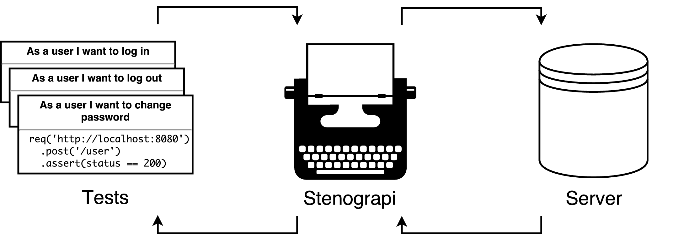

# [](https://github.com/michaelmcmillan/Stenograpi)

> Document your HTTP API automatically through tests.

[](https://travis-ci.org/michaelmcmillan/Stenograpi)
[](https://ci.appveyor.com/project/michaelmcmillan/stenograpi/branch/master)
[](https://coveralls.io/github/michaelmcmillan/Stenograpi?branch=master)
[](https://codeclimate.com/github/michaelmcmillan/Stenograpi)

Stop worrying about keeping your documentation in sync with your HTTP API. Simply proxy your integration tests through Stenograpi and receive documentation on the other end.

## Install
Stenograpi is a standalone Python script that has no external dependencies. Simply run the following command to retrieve the script.

````
wget https://raw.githubusercontent.com/michaelmcmillan/Stenograpi/master/dist/stenograpi.py
````

## Usage

Start Stenograpi by running the script from your command line.

````
python3 stenograpi.py localhost 1337 localhost 1338
````

In your integrated tests, replace the hostname and port of the application you are testing with Stenograpi's hostname and port.

## Mechanics

Stenograpi steps in between your tests and your application. However, neither your tests nor your application will notice any difference. 



While the requests and responses are delivered as usual, Stenograpi will create Markdown documents describing the exchange. The documents are written with developers in mind,
[see for yourself](docs/examples/output.md).
